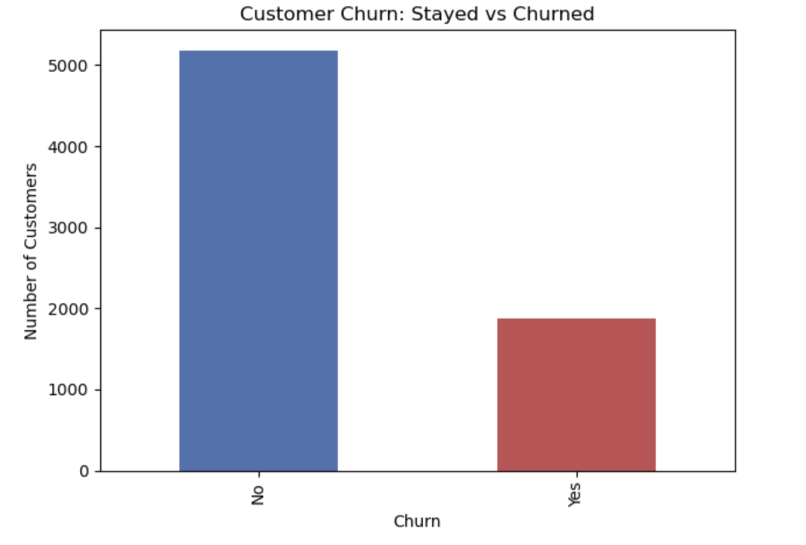
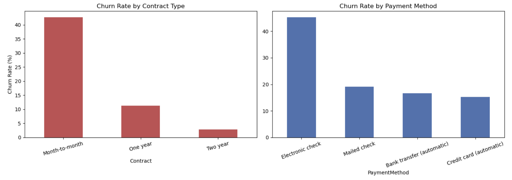
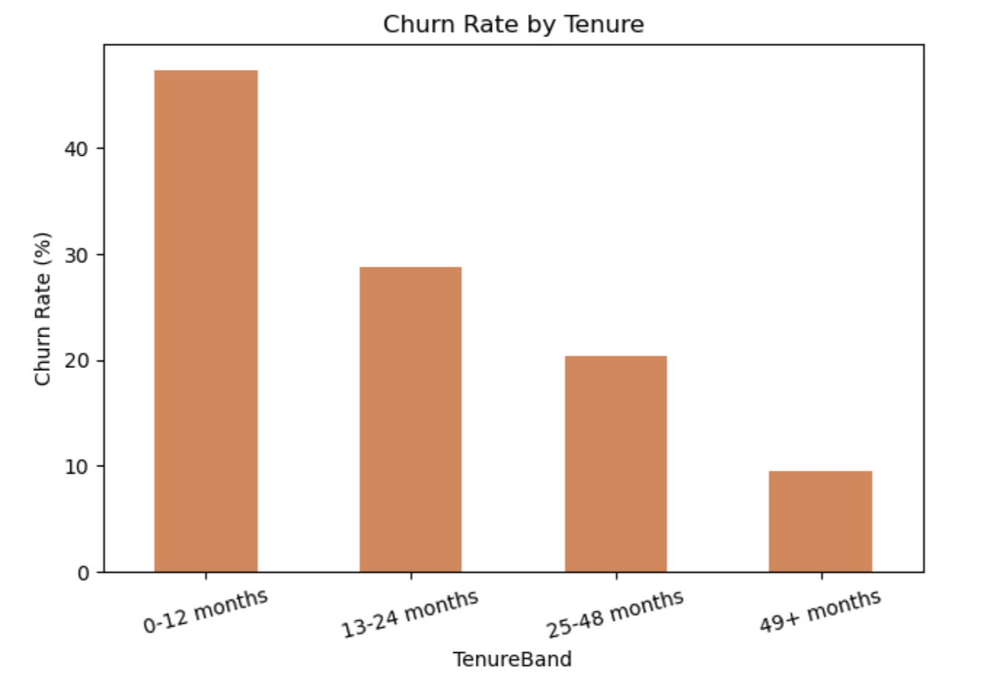
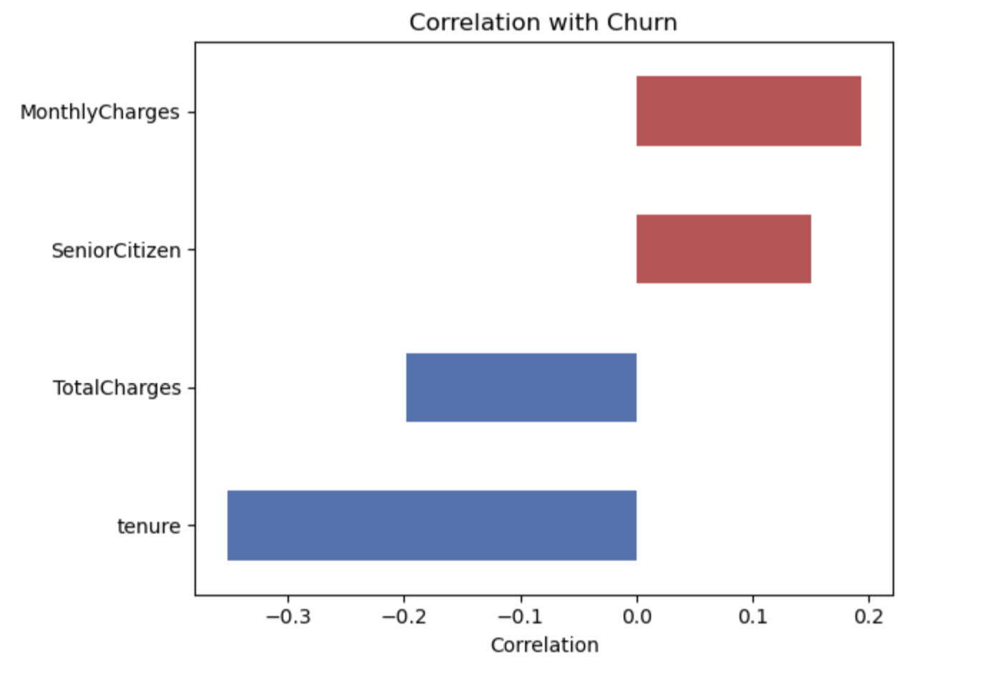
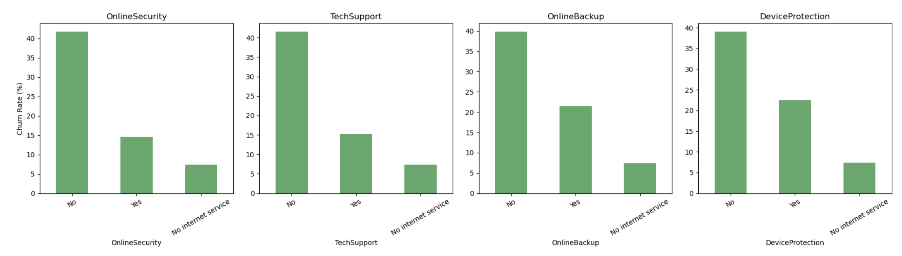
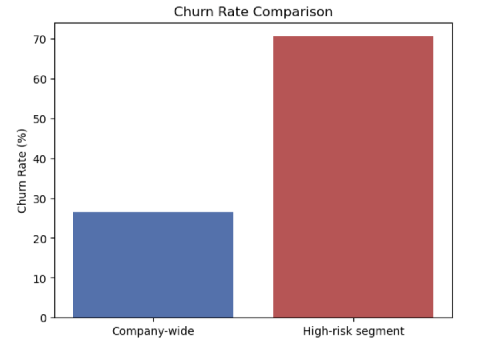

# Telco Customer Churn Analysis

A Python analysis of 7,043 real telecom customers, looking at why people cancel their service, which customers are most likely to leave, and how much money is at risk because of it.

## The Problem

Losing a customer costs more than losing one month's payment — it's lost revenue for as long as they would have stayed. This project looks at real customer data to find out who's most likely to cancel, and why, so the company can act before they leave instead of after.

## The Data

- **Source:** [Telco Customer Churn on Kaggle](https://www.kaggle.com/datasets/blastchar/telco-customer-churn) (real data, not made up)
- **Size:** 7,043 customers, 21 columns
- **What's in it:** how long someone's been a customer, their contract type, payment method, monthly bill, which add-on services they have (security, tech support, etc.), and whether they churned

## Files in This Project

```
├── README.md
├── telco_customer_churn.ipynb   # The notebook with all the analysis
├── Telco_Customer_Churn.csv               # The dataset
├── images/                       # Charts shown below
    ├── churn_overview.png
    ├── contract_payment.png
    ├── tenure.png
    ├── correlation.png
    ├── service_addons.png
    └── segment_comparison.png
```

## What I Looked At

| # | Question |
|---|----------|
| 0 | Is the data clean and ready to use? |
| 1 | What percent of customers cancel overall? |
| 2 | Do contract type and payment method affect who cancels? |
| 3 | Does how long someone's been a customer matter? |
| 4 | Which factors matter most, across the board? |
| 5 | Do extra services (like tech support) help keep customers? |
| 6 | How much money is at risk from the riskiest group of customers? |

## Charts and What They Show

**Q0 — A data cleaning catch worth mentioning:**

> Before charting anything, I noticed one column (`TotalCharges`) was stored as text instead of numbers. Digging in, 11 customers had a blank value there — all of them brand new, with 0 months as a customer, so they simply hadn't been billed yet. Fixed by treating those as $0, not by deleting the rows.

**Q1 — How many customers cancel overall:**



> 26.5% of customers churned (about 1 in 4). That's high for this type of business — most subscription companies see closer to 5-15%.

---

**Q2 — Does contract type or payment method matter:**



> Huge difference. Month-to-month customers cancel at 42.7%, but customers on a two-year contract cancel at just 2.8% — 15 times less. Customers who pay by electronic check also cancel far more (45.3%) than any other payment method.

---

**Q3 — Does customer tenure (how long they've stayed) matter:**



> Yes, a lot. Nearly half of brand-new customers (47.4%) cancel within their first year. That drops to just 9.5% for customers who've stuck around 4+ years. Most of the risk is early on.

---

**Q4 — Which factors matter most overall:**



> Tenure is by far the strongest factor — confirming what Q3 already showed. How long someone's been a customer matters more than anything else measured here.

---

**Q5 — Do extra services help keep customers:**



> Yes. For every add-on (online security, tech support, backup, device protection), customers without it cancel at roughly 40%, while customers with it cancel at only 15-23%. These add-ons are strongly linked to people sticking around.

---

**Q6 — How much money is at risk from the riskiest customers:**



> Combining the three biggest risk factors — new customer, month-to-month contract, and fiber optic internet — creates a group that cancels at 70.5%, compared to 26.5% company-wide. There are 258 active customers who fit this exact profile right now, representing about **$248,770 a year** in revenue at risk.

## Bottom Line

The company's churn problem isn't spread evenly — it's heavily concentrated in new customers on month-to-month contracts with fiber optic internet. Getting these customers onto a longer contract and encouraging add-on services in their first year would likely make the biggest dent in churn.

## Tools Used

Python, pandas, Matplotlib, Seaborn, Jupyter Notebook — no machine learning. Every number here comes from simple grouping and counting, so anyone can follow exactly how it was calculated.

## How to Run It

```bash
pip install pandas numpy matplotlib seaborn jupyter
jupyter notebook Telco_Churn_Analysis.ipynb
```

---

## 👤 Author

Sheena 📧 [sheena.charaya@gmail.com](mailto:sheena.charaya@gmail.com) | 🔗 [LinkedIn](https://linkedin.com/in/sheena-charaya)

*Part of a data analytics portfolio.*
